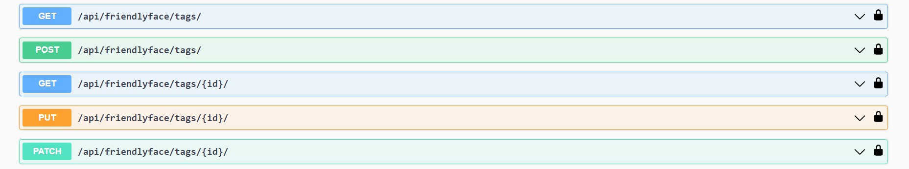
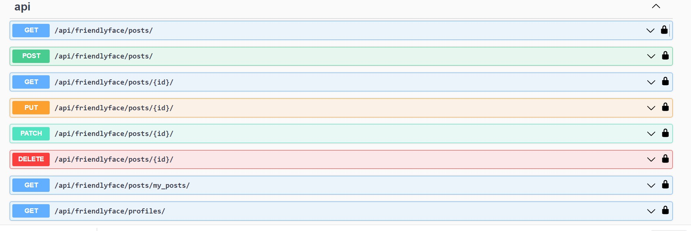
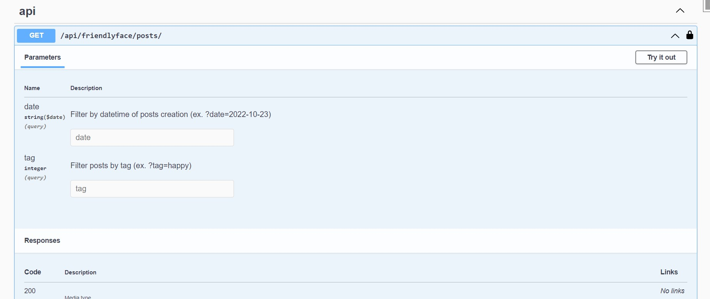
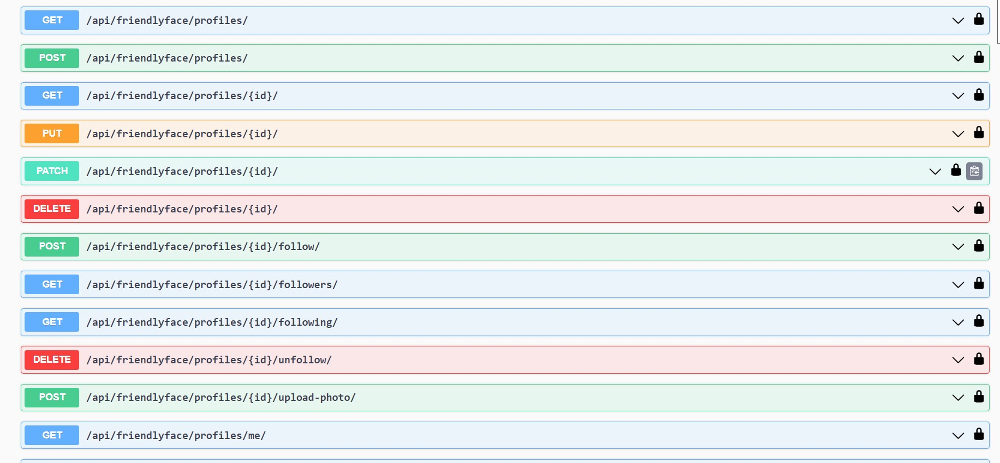
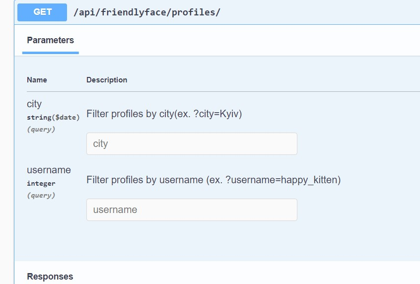

## Social Media Platform RESTful API
This Django RESTful API lets users create profiles and posts,
follow others, and filter posts and profiles. It uses Django REST Framework (DRF)
and drf_spectacular for OpenAPI documentation.

### Tag
The authenticated users are allowed CRUD operations on the Tag model.


### Post
The authenticated users are allowed to see their own posts and posts of their followings.
They could create and delete only their own posts.

They could  filter posts with tags and date.


### Profile
Authenticated user could see list of others profile and 
see detail page for all of them.
They have ability to follow and unfollow other users.
And they could create and delete their own profiles.


It has features to retrieve profiles with filters like username and city.



### Authentication
It uses JWT authentication.

### How to run it 

# Getting started
To get started with the Django Vaccination Tracker, you can follow these steps:

Clone the repository:
``` shell
https://github.com/oksana-feshchenko/social-media.git
```
Navigate to the project directory:
``` shell
cd social-media
```
Install the required packages:
``` shell
 pip install -r requirements.txt
 ```

Create .env file with variable from .env.sample

Run migrations:
``` shell
python manage.py migrate
```
Create a superuser:
 -You can use following superuser (or create another one by yourself):


``` shell 
python manage.py createsuperuser
```
Start the development server:
``` shell
python manage.py runserver
```

